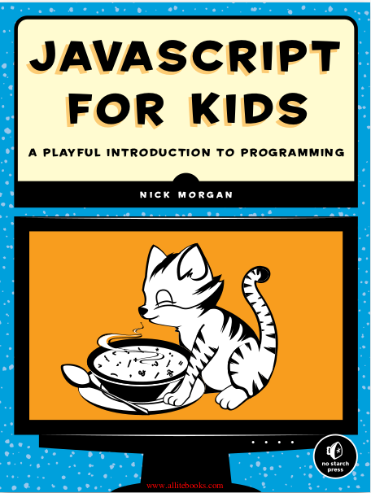
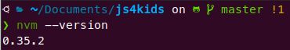
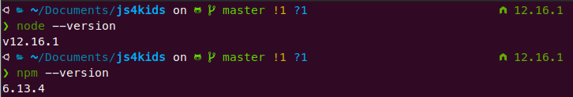

# js4kids
Repository to store all my solutions and notes for the book [JavaScript for Kids](https://www.nostarch.com/javascriptforkids) by [Nick Morgan](https://github.com/skilldrick). 



<br>

## Content:
Every folder contains the solutions to the challenges of that chapter. I'm more used to Back-End development, so I wrote `.js` scripts and ran all of them in terminal with the following command: 

```bash
node *path/to/script.js*
```
> **p.s.:** to run scripts that way, your machine needs to attend all requirements detailed in _Requirements_ subsection.

That's probably not the best way to do this (lol), so feel free to call them in a `.html` file (as shown below) and see them in action in your favourite browser, or just copy and paste its code directly into your browser's console (just press the `F12` key to open it :).  

```html
<!DOCTYPE html>
<html>
    <script src="path/to/script.js"> </script>
</html>
```

### Requirements
To run the scripts on terminal (as I did), you'll need to have [NodeJS](https://nodejs.org/en/) installed in your machine. As I'm writing this README, I'm using Ubuntu 20.04 as operational system on my machine and present the steps I followed to install [NodeJS](https://nodejs.org/en/) and its dependencies. You may want to follow one of these tutorials if you're using a different OS:

> [Windows](https://phoenixnap.com/kb/install-node-js-npm-on-windows) - [Mac OS](https://treehouse.github.io/installation-guides/mac/node-mac.html)


#### Installing NodeJS on Ubuntu

Okay, if you're a Ubuntu user for a while (or any other Debian-based linux distro), you may think that installing `NodeJS` and its package manager [NPM](https://www.npmjs.com/) is as easy as this:

```bash
sudo apt install nodejs npm
```

I did this and, surprisingly, it didn't work *'Out of the Box'*. The problem was that the `NPM` and `NodeJS`versions available on the official PPAs didn't get along very well. 

So, after reading lots of tutorials and testing many different forms of installing these two things, I find out that the best solution was to install them via [NVM](https://github.com/nvm-sh/nvm), which stands for *Node Version Manager* (it's useful to have NVM installed in your machine for plenty other reasons).

Getting to the point, to install NVM, just run the following commands in your terminal: 

```bash
curl -o- https://raw.githubusercontent.com/nvm-sh/nvm/v0.35.3/install.sh | bash
```
or 
```bash
wget -qO- https://raw.githubusercontent.com/nvm-sh/nvm/v0.35.3/install.sh | bash
```
**p.s.:** if you don't have `curl`or `wget` in your system yet, just run
```bash
sudo apt install *package_name*
```

If all went well, the output of `nvm --version` should look like the following:



<br>

Now that NVM was successfully installed, we can install NodeJS and NPM by simply executing:

```bash
nvm install node
```

Personally, I recommend installing the LTS (*Long Term Support*) version by running

```bash
nvm install node --lts
```

And voilà. `NodeJS` and `NPM` were successfully installed with this simple command. If you want to check, the output of `node --version` and `npm --version` both should look like the following:



<br>

Finally, you're all set. To run a `.js` file in terminal, just use 

```bash
node *path/to/script.js*
```


